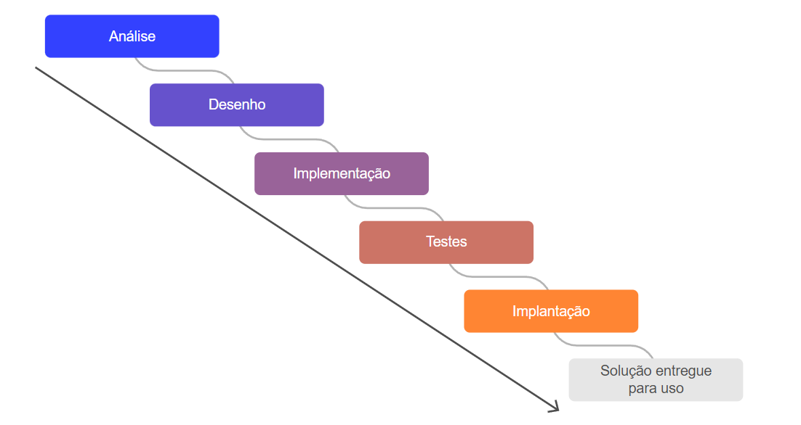
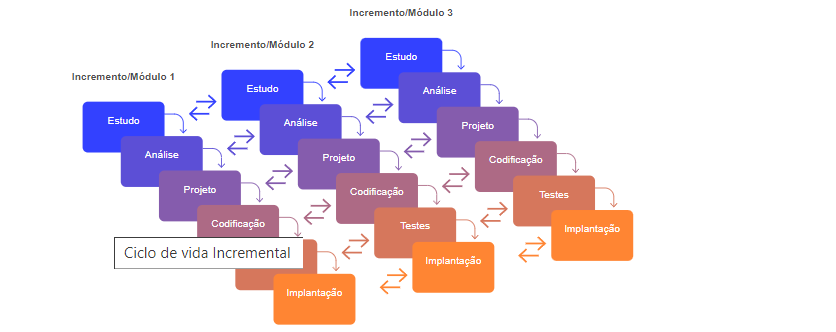
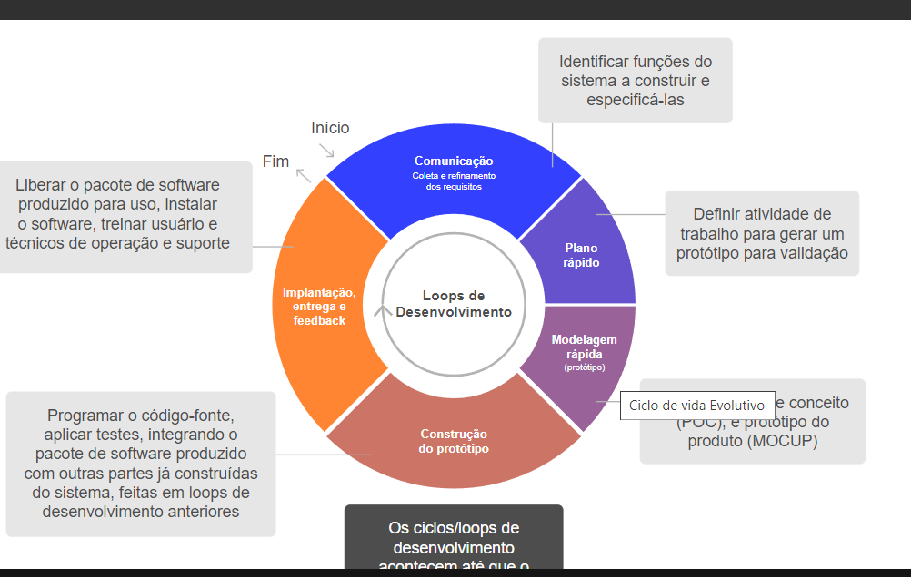

Um software que um dia já foi inovador chega a aposentadoria, por fatores como:

- Obsolescência tecnológica: não consegue mais adaptar o software a novos cenários
- Obsolescência de negócio: modificação do sistema teria de ser profunda para se adaptar a realidade dos negócios.
- Elevados custos de manutenção

Modelos para desenvolver software são - cascata, incremental, evolutivo e espiral.
Cascata:

Fases em sequência, não se volta atrás.
Análise conversa com stakeholders, Desenho utiliza UML, por exemplo.Implementação trata da construção do software. fase de testes - são feitos testes de sistemas e testes com os usuários.Implantação. Manutenção.
Casos de modelo cascata - sequência rígida de produção, escopo não pode ser mudado- redes de computadores para um data center

As fases permanecem as mesmas, na prática é como se eu dividisse por módulos- exemplo RH, exemplo gestão de vendas.

Redução da ansiedade do usuário na espera por uma solução, além de permitir a aferição de benefícios obtidos com as partes entregues da solução ainda no curso do projeto, melhorando o retorno sobre o investimento.

O modelo espiral incorpora o conceito de desenvolvimento e entrega de componentes em frentes de trabalho paralelas, quase que como uma extrapolação da proposta do modelo Evolutivo. 
A aula aborda o ciclo de vida do software, que inclui as fases do desenvolvimento até a aposentadoria do software. Existem dois ciclos principais: o de desenvolvimento e o de uso. Os modelos de ciclo de vida discutidos são o Cascata, Incremental, Evolutivo e Espiral, cada um com suas peculiaridades na gestão das etapas de criação.

O modelo Cascata é sequencial, enquanto o Incremental permite entregas parciais. O Evolutivo utiliza protótipos para validação, e o Espiral foca na gestão de riscos. 

Na fase de uso, que é a manutenção, o software deve se adaptar a mudanças e obsolescência. O texto também destaca a importância de escolher um modelo de processo de desenvolvimento, diferenciando entre processos tradicionais e ágeis, como SCRUM. Metodologias ágeis são apontadas como tendência, especialmente em ambientes DEVOPS.

Por fim, a escolha do ciclo de vida deve ser estratégica, alinhando-se às necessidades do projeto e às expectativas das partes interessadas.

O ciclo de vida do software em uso refere-se à fase de manutenção após o lançamento do software. Durante essa fase, o software precisa se adaptar às mudanças nas regras de negócio e à obsolescência tecnológica. Essa jornada é dividida em quatro estágios principais: introdução, crescimento, maturidade e declínio.

1. **Introdução**: O software é lançado e começa a ser utilizado. É um período de adaptação e correção de problemas iniciais.
   
2. **Crescimento**: O uso do software aumenta, e melhorias são frequentemente implementadas para atender à demanda e aumentar a satisfação dos usuários.

3. **Maturidade**: O software atinge seu pico de uso. A manutenção se concentra em updates e melhorias de performance, embora mais relevantes surjam.

4. **Declínio**: Com o tempo, o software pode começar a perder relevância ou ser substituído por novas tecnologias, levando a um eventual processo de aposentadoria.

A adaptação constante e a manutenção são essenciais para garantir que o software continue a atender às necessidades do negócio e dos usuários ao longo do tempo.

 O RUP (Rational Unified Process) e o SCRUM são abordagens diferentes para o desenvolvimento de software, cada uma com suas características e propósitos.

**RUP (Rational Unified Process)**:
- É um processo de desenvolvimento estruturado, baseado em práticas de engenharia de software e melhoramento contínuo.
- O RUP é dividido em quatro fases principais: Iniciação, Elaboração, Construção e Transição. Cada fase tem seus objetivos, entregas e atividades específicas.
- Ele enfatiza a documentação e a definição clara de requisitos antes de avançar para a implementação.
- O processo é adaptável, permitindo que equipes personalizem o RUP de acordo com as necessidades do projeto.
- O uso de iterações e incrementos é comum, mas o RUP pode ser visto como mais rígido em comparação com metodologias ágeis.

**SCRUM**:
- É uma metodologia ágil que foca em entregas rápidas e adaptabilidade às mudanças.
- O SCRUM é organizado em ciclos chamados Sprints, que normalmente duram de uma a quatro semanas.
- O trabalho é dividido em um backlog de tarefas, priorizado pelo Product Owner, e a equipe trabalha em conjunto para completar um conjunto de tarefas durante cada Sprint.
- A comunicação é central, com reuniões diárias (Daily Scrum) para atualização do progresso e resolução de impedimentos.
- O SCRUM é altamente flexível, permitindo a adaptação contínua do projeto com base no feedback constante das partes interessadas.

Resumindo, enquanto o RUP é mais estruturado e documentação-centrado, o SCRUM é ágil, com foco na colaboração e adaptações rápidas às necessidades do projeto.

Vamos detalhar cada tipo de manutenção mencionada:

1. **Corretivas**: Essas manutenções são realizadas para corrigir falhas ou bugs no software. Quando um problema é identificado, a equipe de desenvolvimento trabalha para resolvê-lo, garantindo que o sistema funcione corretamente.

2. **Adaptativas**: A manutenção adaptativa é necessária quando o software precisa se ajustar a novas situações, como mudanças nas regras de negócio, novas legislações ou atualizações em plataformas onde o software opera. O objetivo é garantir que o sistema continue atendendo às necessidades do negócio.

3. **Evolutivas**: Essas manutenções buscam aprimorar o software, adicionando novas funcionalidades ou melhorando as existentes. Essa evolução pode ser impulsionada por feedback dos usuários ou por mudanças nas demandas de mercado.

4. **Perfectivas**: A manutenção perfectiva tem como foco a melhoria da performance do software e a otimização dos recursos. A ideia é tornar o sistema mais eficiente e eficaz, muitas vezes com ajustes na arquitetura ou no código.

Esses tipos de manutenção garantem que o software permaneça relevante, eficiente e capaz de atender às demandas em constante mudança ao longo do tempo. Se precisar de mais explicações, é só avisar!