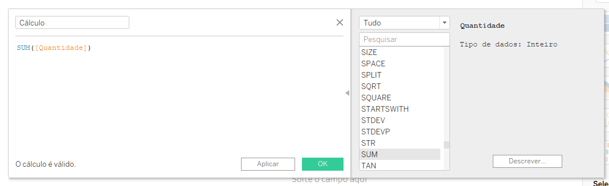
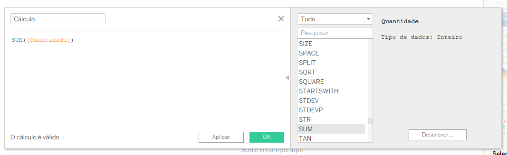
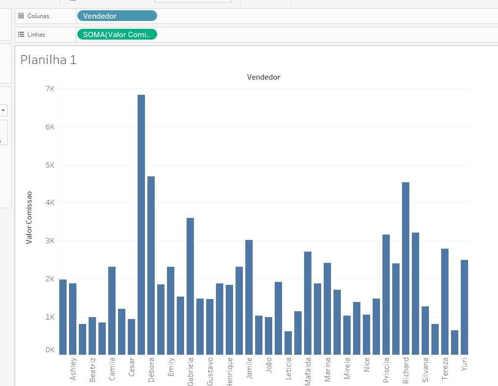
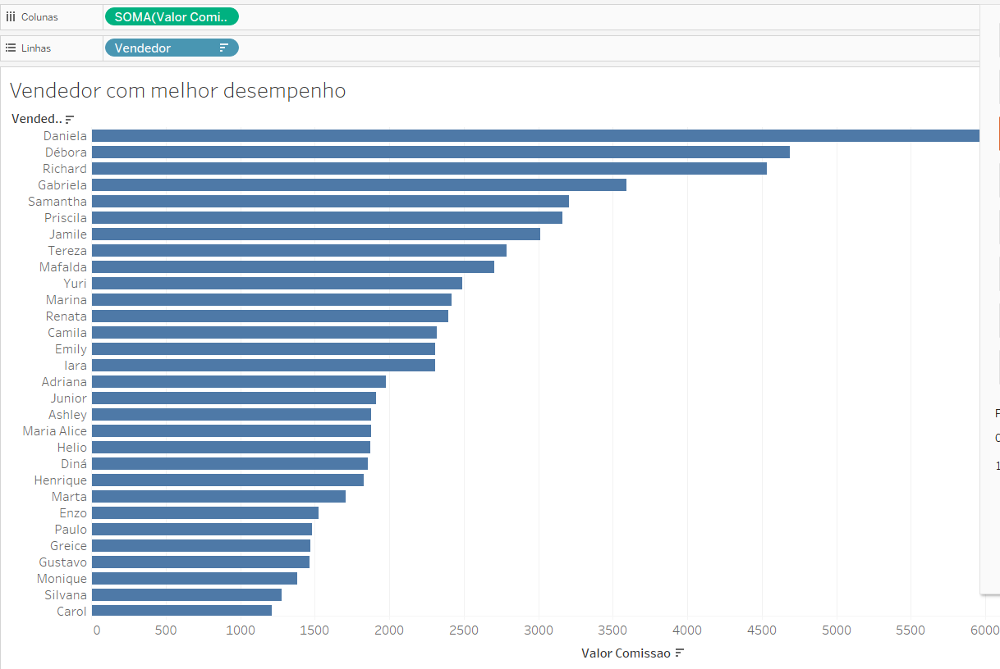
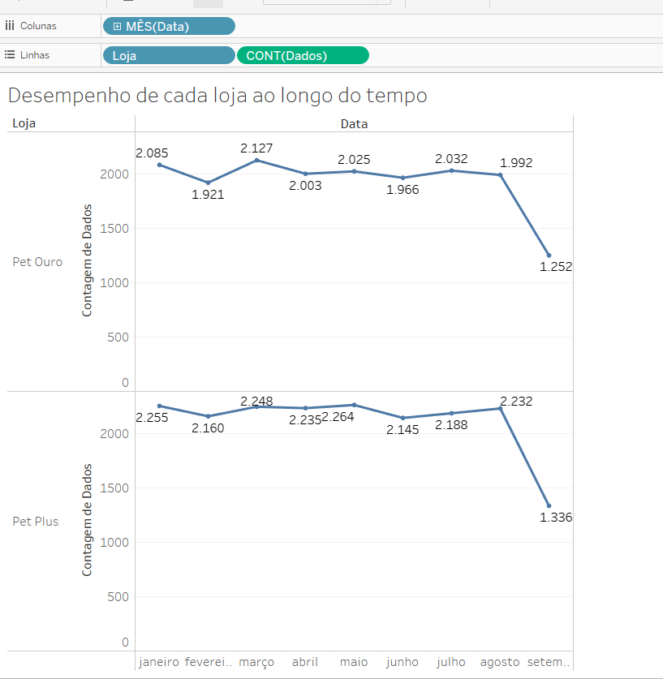
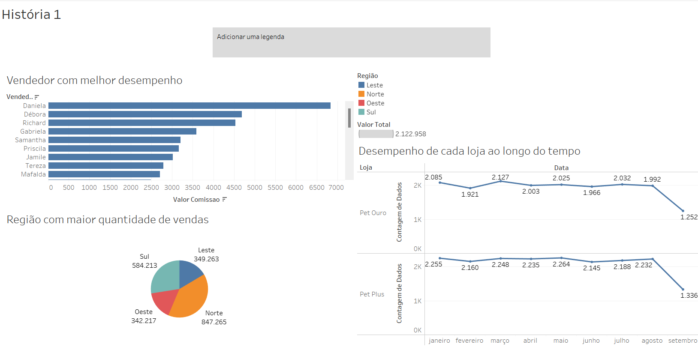

Tableau adquirida pela salesforce
Tableau ajuda na visualização de dados.
Interpretação dos dados.
Tableau separa em dimensão e métrica.
Dimensão - qualitativa
Métrica - quantitativa

Na imagem acima se clicar na seta da para criar um novo campo de calculo
Para saber as expressões clicar na seta, depois disso ao usar a expressao posso arrastar os campos para dentro do parenteses ficando assim:

Saber qual foi o melhor vendedor:
Posso arrastar o vendedor com a comissao e descobrir:

Ao lado de valor comissão temos a opção de por em ordem crescente ou decrescente

Gráfico de pizza serve para dar respostas curtas.

Abaixo na imagem podemos ver um desempenho das lojas comparando as duas lojas e suas vendas:

Para criar um story, fazemos o dashboard e depois coloca o dashboard e cria uma legenda contando a história:

