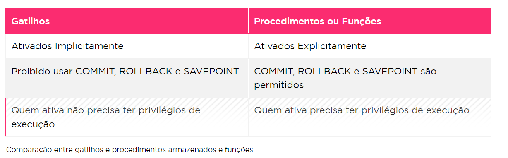

Os gatilhos são desenvolvidos para serem executados em resposta aos seguintes eventos:
- comando DML - Insert, Update, or DELETE
- Comando DDL - Data definition Language - Create, alter ou DROP
- uma operação de banco de dados (LOGON, LOGOFF, SERVERERROR, STARTUP< SHUTDOWN)

CREATE [OR REPLACE] TRIGGER [esquema.]nome_trigger 
{BEFORE ou AFTER} 
[evento] ON [esquema.]tabela_nome
[referencing Old as valor_anterior ou NEW as valor_novo)
{nível de linha ou nível de instrução} [WHEN (condição)]] DECLARE
BEGIN
   corpo_trigger 
END;