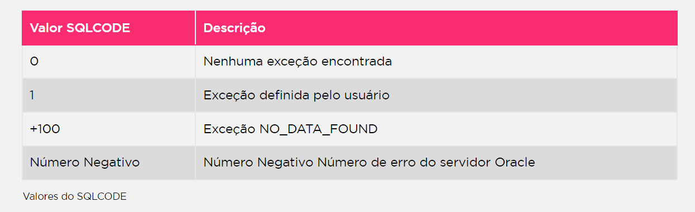

Como tratar exceções de erros?
Cada WHEN puxa o erro para si 
WHEN OTHERS THEN - tratamento generalizado.
DUP_VAL_ON_INDEX - Tentativa de inserir um valor duplicado, exemplo: inserir empregado 1, e depois empregado 1 de novo

EXCEPTION
WHEN exceção1 [OR exceção2 …] THEN
  comando1;
  comando2;
  …
[WHEN exceção3 [OR exceção4 …] THEN
  comando1;
  comando2;
  …]
[WHEN OTHERS THEN
  comando1;
  comando2;
  …]

  Oracle predefiniu exceções para alguns erros mais comuns. Nesse caso, não existe a necessidade de as exceções serem declardas apara serem utilizadas, porque fazem parte do pacote standard

  Valores que podem ser assumidos pelo SQLCODE:

