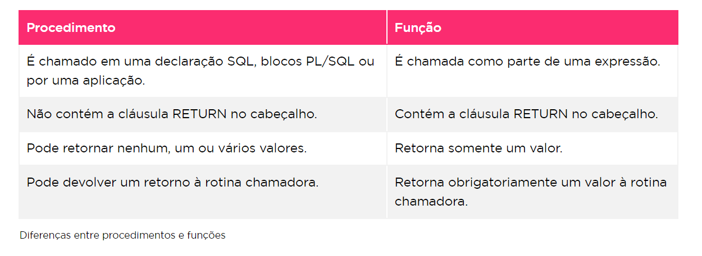

Funções que vão retornar alguma coisa- no Oracle sempre retorna algo.
-- MAX(), MIN(), AVG(), SUM()...

CREATE [ OR REPLACE] FUNCTION nome_função
parâmetro [in] tipo_parâmetro,
  ...
return tipo_do_retorno

{IS ou AS}

BEGIN
   corpo_da_função
END nome_função;

Caso haja necessidade de obter o código fonte pode se usar:

SELECT text
FROM user_source
WHERE name = 'ORDINAL'
ORDER BY line;

Como ver os erros das funções:
comando SHOW ERRORS, VIEWS: USER ERRORS, ALL_ERRORS, DBA_ERRORS
