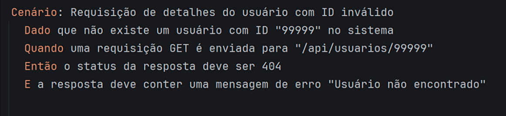
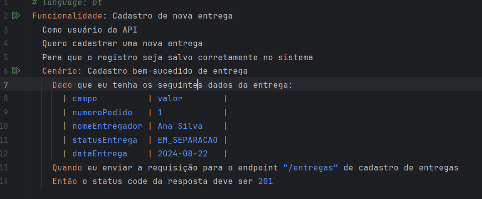
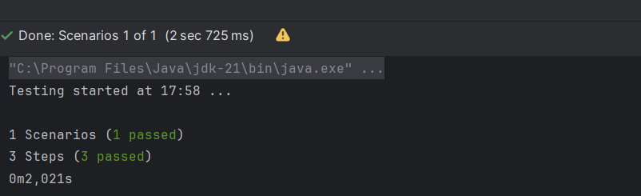

### Resumo da Aula sobre Testes Automatizados e BDD

1. **Introdução ao BDD**
   - Os testes automatizados são essenciais para garantir o comportamento esperado das aplicações, reduzindo erros e aumentando a eficiência.
   - O Behavior Driven Development (BDD) facilita a comunicação entre desenvolvedores e stakeholders, utilizando a linguagem Gherkin para cenários compreensíveis.

2. **História e Frameworks do BDD**
   - O BDD é uma evolução do Test Driven Development (TDD), com Cucumber sendo a ferramenta mais popular. Outros frameworks incluem SpecFlow e Behave.

3. **Estruturação de Cenários em BDD**
   - Cenários devem ser escritos na estrutura “Dado-Quando-Então”, priorizando a perspectiva do usuário e evitando jargões técnicos.

4. **Configuração de Ambiente**
   - Inclui instalação da IDE IntelliJ, configuração de projetos com Maven e dependências como Cucumber e Rest Assured.

5. **Implementação de Testes**
   - Os alunos aprendem a implementar cenários de teste de APIs, validando respostas e tratando erros.

6. **Contextos e Testes de Contrato**
   - A utilização de contextos para manter testes independentes e o uso de JSON Schema para testes de contrato garantem integridade nas respostas da API.

7. **Organização de Testes via Tags**
   - As tags no Gherkin permitem categorizar e gerenciar os testes, como @regressivo e @funcional.

8. **TestRunner e Hooks**
   - Configuração do TestRunner para gerenciar a execução dos testes e uso de Hooks para executar código automaticamente antes ou depois dos testes.

9. **Execução de Testes com Maven**
   - Como executar testes fora da IDE através do Maven, com configurações no `pom.xml`.

10. **Integração em Pipeline CI/CD**
    - Demonstração de como integrar testes em uma pipeline CI/CD usando GitHub Actions.

11. **Conclusão e Importância dos Testes Automatizados**
    - Enfatiza a relevância dos testes automatizados para a qualidade do software e a prevenção de bugs.

12. **Recursos e Referências**
    - Sugestões para aprofundamento na área de testes automatizados e links para repositório GitHub com soluções da aula.

A aula também incentiva os alunos a entender e praticar os conceitos discutidos, além de compartilhar experiências e aprendizados na implementação de testes durante o desenvolvimento de software.

Optar pelo BDD garante que o software atenda as necessidades de negócios de forma clara para todos os envolvidos.


baixar projeto, subir docker, depois no intellij ir em settings, plugin - pesquisar Cucumber for java , fazer o mesmo com o lombok
Em settings Editor, inspections- procure Typo e desligue a opção proofreading- apply -ok 
Criar uma pasta features dentro de src/test/resources
cirar um pacote dentro de src/test/javacriar um pacote dentro de src/test/java/sevices, tb uma pasta model
criar um arquivo Cadastro.feature, e criar o teste
Colocar feature no singular em vez de no plural.
# language: pt
Funcionalidade: Cadastro de nova entrega
  Como usuário da API
  Quero cadastrar uma nova entrega
  Para que o registro seja salvo corretamente no sistema
  Cenário: Cadastro bem-sucedido de entrega
    Dado que eu tenha os seguintes dados da entrega:
      | campo          | valor        |
      | numeroPedido   | 1            |
      | nomeEntregador | Ana Silva    |
      | statusEntrega  | EM_SEPARACAO |
      | dataEntrega    | 2024-08-22   |
    Quando eu enviar a requisição para o endpoint "/entregas" de cadastro de entregas
    Então o status code da resposta deve ser 201

Clicar nesse arquivo na lampada na opção steps. Em file-name - CadastroEntregasSteps
campo file-type - java
fole location - src/test/java/steps
Depois alterar o arquivo CadastroEntregasSteps:

package steps;
import io.cucumber.java.pt.Dado;
import io.cucumber.java.pt.Então;
import io.cucumber.java.pt.Quando;
public class CadastroEntregasSteps {
    @Dado("que eu tenha os seguintes dados da entrega:")
    public void queEuTenhaOsSeguintesDadosDaEntrega() {
    }
    @Quando("eu enviar a requisição para o endpoint {string} de cadastro de entregas")
    public void euEnviarARequisiçãoParaOEndpointDeCadastroDeEntregas(String endPoint) {
    }
    @Então("o status code da resposta deve ser {int}")
    public void oStatusCodeDaRespostaDeveSer(int statusCode) {
    }
}


Vamos criar a model:

package model;
import com.google.gson.annotations.Expose;
import lombok.Data;
@Data
public class EntregaModel {
    @Expose(serialize = false)
    private int numeroEntrega;
    @Expose
    private int numeroPedido;
    @Expose
    private String nomeEntregador;
    @Expose
    private String statusEntrega;
    @Expose
    private String dataEntrega;
}
@Expose(serialize = false)- numero da entrega seja excluído do processo de serialização(obj java é convertido para JSON)
@Data- gera getters ands setters- implementa os equals and hashcodes.

Criar arquivo CadastroEntregasService- src/teste/java/services

package services;
import com.google.gson.Gson;
import com.google.gson.GsonBuilder;
import io.restassured.http.ContentType;
import io.restassured.response.Response;
import model.EntregaModel;
import static io.restassured.RestAssured.given;
public class CadastroEntregasService {
    final EntregaModel entregaModel = new EntregaModel();
    public final Gson gson = new GsonBuilder()
            .excludeFieldsWithoutExposeAnnotation()
            .create();
    public Response response;
    String baseUrl = "http://localhost:8080";
    public void setFieldsDelivery(String field, String value) {
        switch (field) {
            case "numeroPedido" -> entregaModel.setNumeroPedido(Integer.parseInt(value));
            case "nomeEntregador" -> entregaModel.setNomeEntregador(value);
            case "statusEntrega" -> entregaModel.setStatusEntrega(value);
            case "dataEntrega" -> entregaModel.setDataEntrega(value);
            default -> throw new IllegalStateException("Unexpected feld" + field);
        }
    }
    public void createDelivery(String endPoint) {
        String url = baseUrl + endPoint;
        String bodyToSend = gson.toJson(entregaModel);
        response = given()
                .contentType(ContentType.JSON)
                .accept(ContentType.JSON)
                .body(bodyToSend)
                .when()
                .post(url)
                .then()
                .extract()
                .response();
    }
}

excludeFieldsWithoutExposeAnnotation() - somente campos com @xpose são incluídos na conversão JSON.

o método setFieldsDelivery - aceita 2 parametros: field e value
se o valor de field nao corresponder a nenhum caso esperado- lança exceção IllegalStateException

createDelivery - envia uma requisição POST para a Api
Envia a requisição usadno a biblioteca - Rest Assured

Vamos detalhar cada um dos componentes mencionados: **Given, When, Then** e também **Extract**.

### 1. Given, When, Then
Esses são os três componentes fundamentais na escrita de cenários de teste usando a linguagem Gherkin em BDD.

- **Given (Dado)**: 
  - Este componente é usado para estabelecer o contexto inicial. Ele descreve a condição do sistema antes que uma ação seja executada. 
  - Exemplo: `Dado que o usuário está logado na plataforma`

- **When (Quando)**:
  - Este componente descreve a ação que o usuário realiza. É o evento que desencadeia uma interação.
  - Exemplo: `Quando o usuário clica no botão de enviar`

- **Then (Então)**:
  - Este componente descrê o resultado esperado após a ação. É onde você especifica a verificação que deve ser feita para validar o comportamento do sistema.
  - Exemplo: `Então a mensagem de confirmação deve ser exibida`

### 2. Extract (Extração)
**Extract** não é um termo oficial do Gherkin, mas pode se referir à prática de **extração de dados** ou **validação de informações** ao longo do cenário de teste. Isso pode envolver:

- **Extração de valores**: Capturar dados de uma resposta de API ou interface para uso posterior no teste. 
- **Validação de dados**: Verificar se os dados extraídos correspondem às expectativas. Isso é muitas vezes feito através de validações em resposta de requisições.

Por exemplo:
Após fazer uma requisição para uma API, você pode:
```gherkin
Dado que faço uma requisição para o endpoint de usuários
Quando receber a resposta
Então extraio o ID do usuário
E valido que o ID corresponde ao esperado
```

Esses componentes ajudam a estruturar o teste de forma clara e compreensível, permitindo que tanto desenvolvedores quanto demais stakeholders entendam o que está sendo testado e qual deve ser o comportamento esperado.

Integrar o services com o CadastroEntregasSteps

@Quando envia requisição para o endpoint de cadastro
@Entao - ver se o status code é o esperado



Se tiver dado certo aparecerá uma tela assim:


Escrever outros cenáruos ajuda na robustez da aplicação:

Cenário: Cadastro de entrega sem sucesso ao passar o campo statusEntrega inválido
    Dado que eu tenha os seguintes dados da entrega:
      | campo          | valor      |
      | numeroPedido   | 1          |
      | nomeEntregador | Ana Silva  |
      | statusEntrega  | EM_ROTA    |
      | dataEntrega    | 2024-08-22 |
    Quando eu enviar a requisição para o endpoint "/entregas" de cadastro de entregas
    Então o status code da resposta deve ser 400
    E o corpo de resposta de erro da api deve retornar a mensagem "Dados fornecidos estão em formato inválido."

    E - além de verificar o status valida mensagem de erro

    Ao adcionar o E precisamos clicar na lampada e criar o set definition

    Isso criará o passo E
Cria o step com o parametro agr0- como boa pratica mudar para message
        @E("o corpo de resposta de erro da api deve retornar a mensagem {string}")
    public void oCorpoDeRespostaDeErroDaApiDeveRetornarAMensagem(String message) {
    }

    Criar um Model com a mensagem de erro, voltar no CdastroEntregasSteps e atualiar o codigo 

        @E("o corpo de resposta de erro da api deve retornar a mensagem {string}")
    public void oCorpoDeRespostaDeErroDaApiDeveRetornarAMensagem(String message) {
        ErrorMessageModel errorMessageModel = cadastroEntregasService.gson.fromJson(
                cadastroEntregasService.response.jsonPath().prettify(), ErrorMessageModel.class);
        Assert.assertEquals(message, errorMessageModel.getMessage());
    }