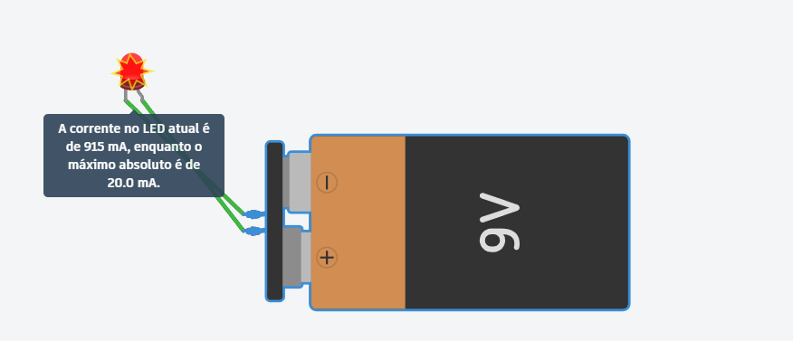
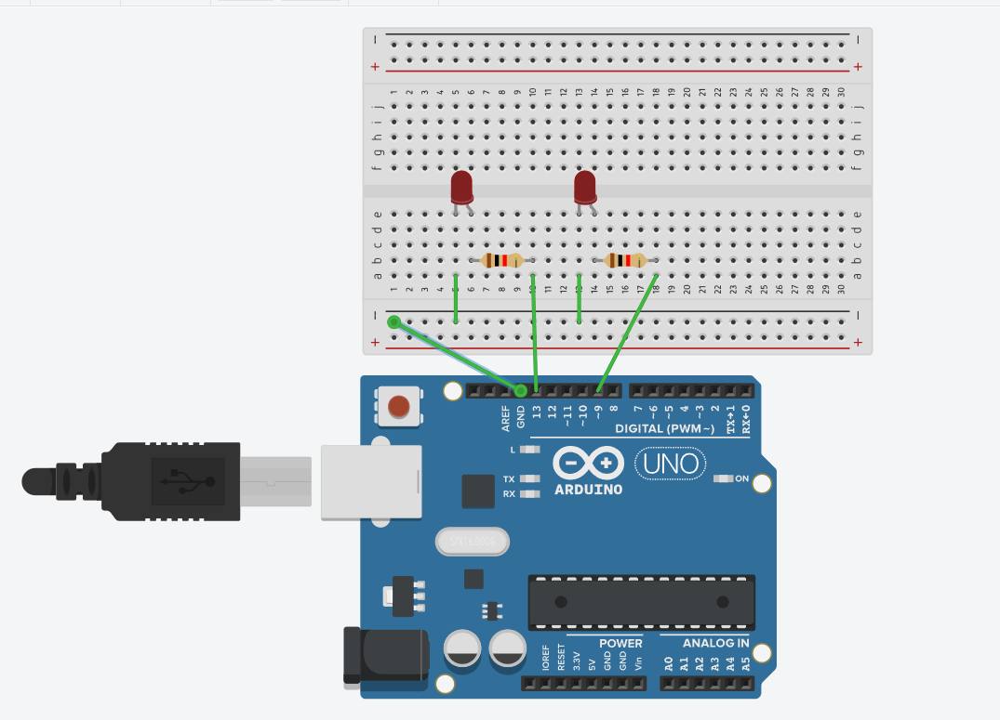

1. **Introdução ao Arduino**:
   - Criado em 2005 por pesquisadores italianos para facilitar projetos de robótica.
   - O Arduino UNO integra uma placa-mãe e um microcontrolador da Microchip, utilizando uma IDE acessível.
   - Funciona como um computador, armazenando dados para automação e é open-source, permitindo o uso de vários sensores.

2. **Aplicações do Arduino**:
   - Exemplos práticos incluem projetos como &quot;Tweet-a-Pot&quot; (café por tweet), &quot;Garduino&quot; (irrigação automatizada) e drones.

3. **Comparação entre Arduino e Raspberry Pi**:
   - Arduino: Microcontrolador, ideal para gerenciar sensores.
   - Raspberry Pi: Um microprocessador, funcionando como um computador completo.

4. **Pré-requisitos e Simulação com Tinkercad**:
   - Tinkercad permite simulação de circuitos, isentando os alunos de utilizar hardware físico.

5. **Fundamentos de Circuitos Elétricos**:
   - Conceitos como tensão e corrente elétrica são essenciais no uso do Arduino, com foco na segurança dos circuitos.

6. **Sensores e Transdutores**:
   - Sensores são categorizados em analógicos e digitais, convertendo energia em sinais elétricos que o Arduino pode utilizar.

7. **Desenvolvimento de Projetos Práticos**:
   - Exemplos incluem:
     - Controle de Luz com Potenciômetro (ajuste de LED).
     - Controle de Semáforo (simulação de trânsito com LEDs).
     - Alarme com Sensor Ultrassônico (detecção de objetos).

8. **Construção de um Gateway com MQTT**:
   - Protocólos de comunicação em IoT, como MQTT para dispositivos de baixo consumo.

9. **Node-RED**:
   - Ferramenta visual para criar aplicações IoT conectando dispositivos, APIs e serviços.

Fazer login no tinkercad, depois criar projeto:

Resistor controla a quantidade de corrente
Protoboard consiste em uma placa didática composta de uma mariz de contatos, que permite a construção de circuitos sem a necessidade de efetuar a solda dos componentes.

Conversor analógico digital - pega a tensao do mundo real e converte em 0-1

Num sistema embarcado onde tem restrição de memória, precisamo comunicar o MQTT
1 qator - publicar 
2 ator - apenas le - fica ouvindo - subscribe

O MQTT (Message Queuing Telemetry Transport) é um protocolo de comunicação leve e eficiente, especialmente projetado para dispositivos com baixa largura de banda e alto tempo de latência. Aqui estão alguns pontos importantes sobre o MQTT:

### Características do MQTT
- **Pub/Sub**: Utiliza um modelo de publicação e assinatura (publish/subscribe), onde os dispositivos podem publicar mensagens em tópicos e se inscrever para receber mensagens desses tópicos.
- **Leveza**: É um protocolo bastante leve, o que o torna ideal para dispositivos de Internet das Coisas (IoT) que possuem limitações de recursos.
- **Qualidade de Serviço (QoS)**: O MQTT oferece três níveis de QoS, permitindo que os usuários escolham como garantir a entrega das mensagens:
  1. **QoS 0**: &quot;At most once&quot; - A mensagem é enviada uma vez e não há garantia de entrega.
  2. **QoS 1**: &quot;At least once&quot; - A mensagem é garantida para ser entregue pelo menos uma vez, mas pode ser recebida múltiplas vezes.
  3. **QoS 2**: &quot;Exactly once&quot; - A mensagem é garantida para ser entregue exatamente uma vez.

### Funcionalidade
- O cliente MQTT se conecta a um broker (servidor) MQTT que gerencia a distribuição das mensagens. Os clientes podem ser dispositivos IoT, aplicativos ou serviços web.
- Quando um cliente publica uma mensagem em um tópico, o broker a entrega a todos os clientes que se inscreveram nesse tópico.

### Vantagens
- **Eficiente em termos de largura de banda**: Utiliza cabeçalhos pequenos e reduz o overhead.
- **Ideal para comunicação em ambientes com rede instável**: Possui mecanismos que ajudam a lidar com perdas de conexão.

O MQTT é amplamente utilizado em aplicações onde a comunicação entre dispositivos é essencial, como em automação residencial, monitoramento de condições ambientais, e outras soluções de IoT.

