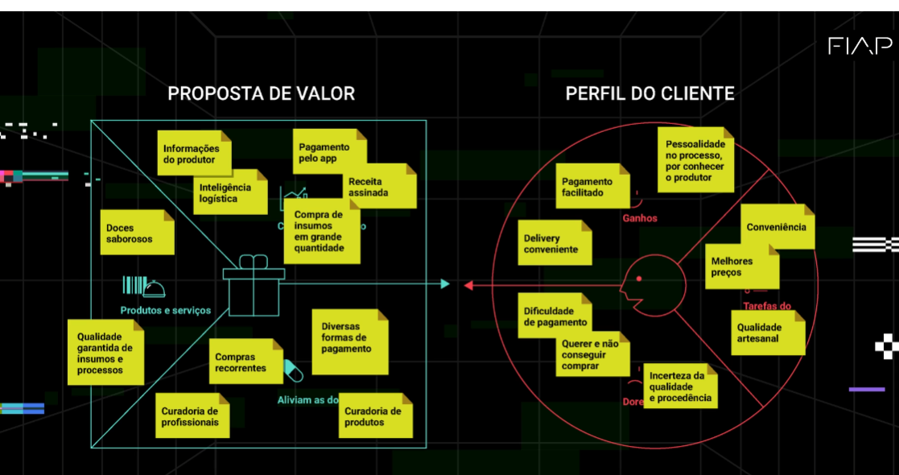
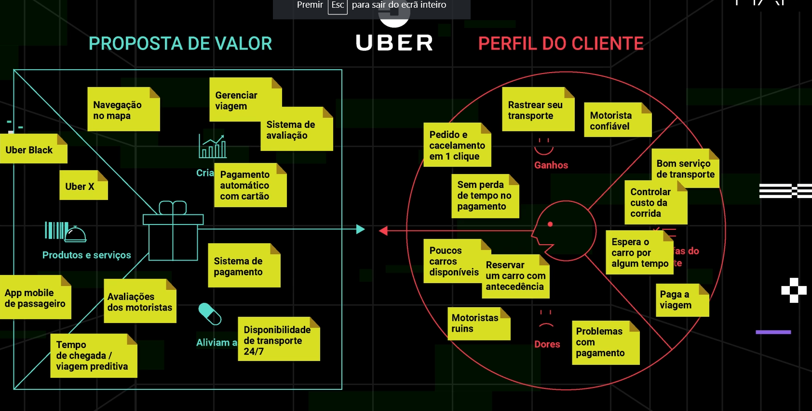
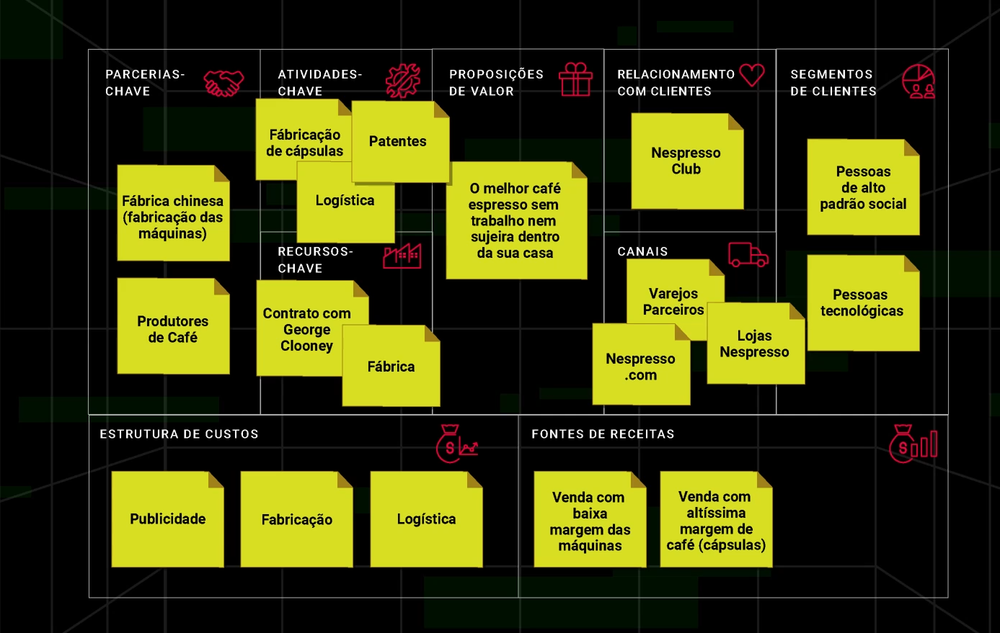

Canvas serve para descartar ideia ruim. 
Netflix - canal físico para canal digital.
Persona, às vezes depende do momento. Exemplo: shampoo de cabelo, todos precisam lavar o cabelo, mas nem todos usam o mesmo tipo de shampoo.
Fez os canvas desdobra as ideias. 
Botar as informações no papel.
Canvas explicar o seu negócio.
Quanto custa manter essa estrutura.
Pitch - problema, solução, como ganha dinheiro.

Canvas proposta de valor - Cliente e proposta de valor

Solução para cada coisa que o clinete levantou 

![Proposta] (img/uber_proposta.png)

Canvas modelo de negócio
Clientes - se é pf, se tem mais de um cliente
se tiver 3 clienets 3 post-it de cores diferentes

