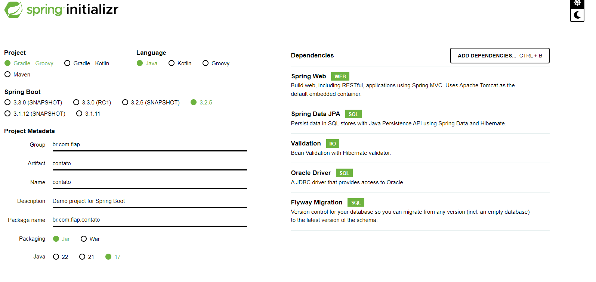

Aplicação monolítica, não tinha flexibilidade para mexer num pedaço da aplicação.
Web services - 2 aplicações - front end e o backend - mexendo nos dados.
Web service utiliza protocolos que permitem a comunicação entre diversos sistemas através ded rede local ou internet.
Rest - Representational state transfer - transferir dados do cliente para servidor
Glória do Rest - todos os verbos http de forma correta, links para páginas seguintes, total de itens
Modelo de Maturidade de Richardson

Nível 0 – Conhecido como o Pântano de XML (Extensible Markup Language).
Neste nível, o desenvolvedor não utiliza os verbos HTTP corretamente, assim como
tornar apenas um endpoint responsável por várias funcionalidades, tais como inserir
e consultar alunos. Geralmente utiliza XML para representar os objetos.
Nível 1 – Conhecido como Recursos, onde busca-se a utilização de um
endpoint para cada funcionalidade, mas ainda não se aplicam os verbos HTTP
corretamente. Geralmente são utilizados apenas os verbos GET e POST

Nível 2 – Chamado de Verbos HTTP, pois considera o uso eficiente dos
endpoints (nível 1) e dos verbos HTTP (nível 2). Neste nível também se considera o
retorno correto dos status codes de cada endpoint.
Nível 3 – Neste nível, conhecido como Controle de Hipermídia, além de
aplicar o nível 1 e 2, haverá algo novo, que fornece aos clientes os links para a
navegação entre os recursos da API. Por exemplo, em uma consulta com paginação,
o resultado atual poderá conter o link para as páginas anterior e seguinte, além de
dados como quantidade de páginas, recursos etc.

Headers - variáveis que vão informar que só aceita arquivos html
pode colocar um cabeçalho de autorização. E coloca o token de autenticação.

Spring boot - framewor mais utilizado. Construção das urls das apis

start.spring.io

Todo browse web ouve na prota 80. A da tomcat por padrão é 8080.
Whitelabel Error Page
This application has no explicit mapping for /error, so you are seeing this as a fallback.

Wed May 01 17:43:37 BRT 2024
There was an unexpected error (type=Not Found, status=404).

Model view e controller - controller reebe a requisição e passa
Tem de fazer anotação @RestController
@RequestMapping("/api") - mapear a url 

@RestController
@RequestMapping("/api")
public class HelloController {

    @GetMapping("/hello")
    public String hello(){
        return "Hello World";
    }

    @GetMapping("/ola")
    public String ola(){
        return "Olá, mundo!";
    }
}

GetMapping dizendo que a requisição é um get

JDBC - biblioteca que faz a interação com o banco de dados
Pensando nisso criaram o JPA

Equals and hashcode - distibguir a instancia de um objeto de outro objeto

Dependencia validation - ver se o clinete esta enviando os dados corretos para nosso endpoint
flyway- versão de controle de banco

Clicar em explore para atualizar o pom

Repositório - classe que é responsável por consultar os dados

public interface ContatoRepository extends JpaRepository <Contato, Long>{
    
    public Contato findByNome(String nome);
    
    public List<Contato> findByDataNascimentoBetween(LocalDate dataInicial, LocalDate dataFinal);
}

Tem uma documentação com as queries ja prontas, por padrão usa FindBy nome do atributo

Controller só sabe receber a requisição e despachar para outro lidar com ela, então não é legal deixar ele consultar 
Por isso, o controller chama o serviço. 
Fica com uma responsabilidade única

Já mandou o registro, já gravou o id, devolve o objeto completo

    @Autowired - para poder instanciar o objeto 

Como fica o Service:
package br.com.fiap.contato.service;

import br.com.fiap.contato.model.Contato;
import br.com.fiap.contato.repository.ContatoRepository;
import org.springframework.beans.factory.annotation.Autowired;
import org.springframework.stereotype.Service;

import java.time.LocalDate;
import java.util.List;
import java.util.Optional;

@Service
public class ContatoService {

    @Autowired
    private ContatoRepository contatoRepository;

    public Contato gravar(Contato contato){
        return contatoRepository.save(contato);
    }

    public Contato buscarPorId(Long id){

        Optional<Contato> contatoOptional = contatoRepository.findById(id);
        if(contatoOptional.isPresent()){
            return contatoOptional.get();
        } else{
            throw new RuntimeException("Contato não encontrado!");
        }
    }

    public List<Contato> listarTodosOsContatos(){
        return contatoRepository.findAll();
    }

    public void excluir(Long id){
        Optional<Contato> contatoOptional = contatoRepository.findById(id);

        if(contatoOptional.isPresent()){
            contatoRepository.delete(contatoOptional.get());
        }else{
            throw new RuntimeException(("Contato não encontrado!"));
        }
    }

    public List<Contato> mostrarAniversariantes(LocalDate dataIncial, LocalDate dataFinal){
        return contatoRepository.findByDataNascimentoBetween(dataIncial, dataFinal);
    }

    public Contato atualizar(Contato contato){
        Optional<Contato> contatoOptional = contatoRepository.findById(contato.getId());

        if(contatoOptional.isPresent()){
            return contatoRepository.save(contato);
        }else{
            throw new RuntimeException(("Contato não encontrado!"));
        }
    }
}

@RestController
@RequestMapping("/api")
public class ContatoController {

    @Autowired
    private ContatoService service;

    @PostMapping("/contatos")
    @ResponseStatus(HttpStatus.CREATED)
    public Contato gravar(@RequestBody Contato contato){
        return service.gravar(contato);
    }

    @ResponseStatus(HttpStatus.OK)
    @GetMapping("/contatos")
    public List<Contato> listarTodosOsContatos(){
        return service.listarTodosOsContatos();
    }

    @DeleteMapping("contatos/{id}")
    @ResponseStatus(HttpStatus.NO_CONTENT)
    public void excluir(@PathVariable Long id){
         service.excluir(id);
    }

    @PutMapping("/contatos")
    @ResponseStatus(HttpStatus.OK)
    public Contato atualizar(Contato contato){
        return service.atualizar(contato);
    }

    @ResponseStatus(HttpStatus.OK)
    @GetMapping("/contatos/{nome}")
    public Contato buscarContatoPleoNome(@PathVariable String nome){
        return service.buscarPeloNome(nome);
    }

    @ResponseStatus(HttpStatus.OK)
    @GetMapping("/contatos/{dataInicial}/{dataFinal}")
    public List<Contato> mostrarAniversariantes(@PathVariable LocalDate dataiInicial,@PathVariable LocalDate dataFinal){
        return service.mostrarAniversariantes(dataiInicial, dataFinal);
    }

}
